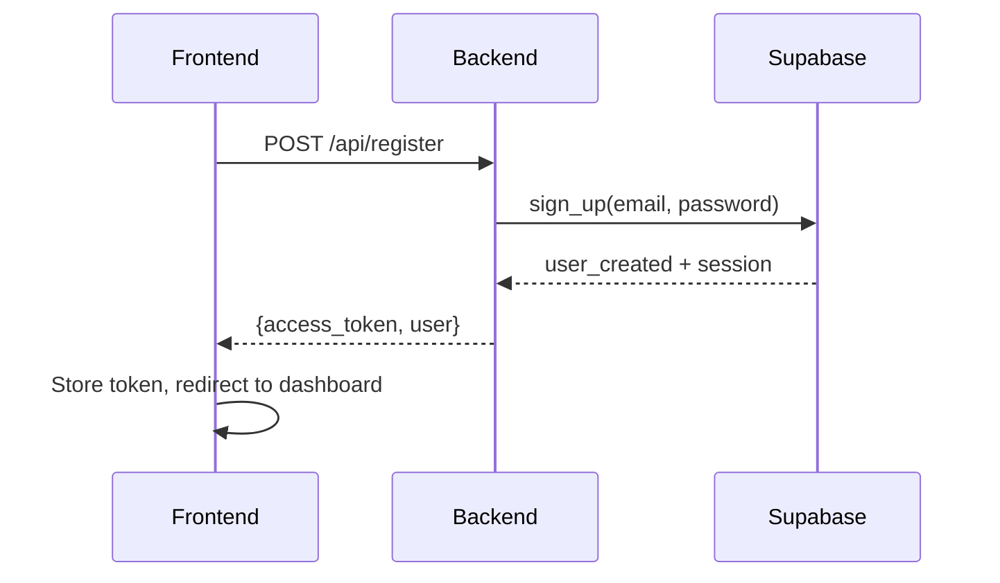
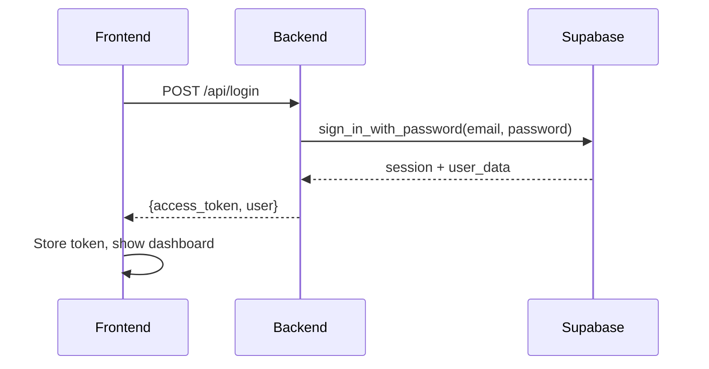
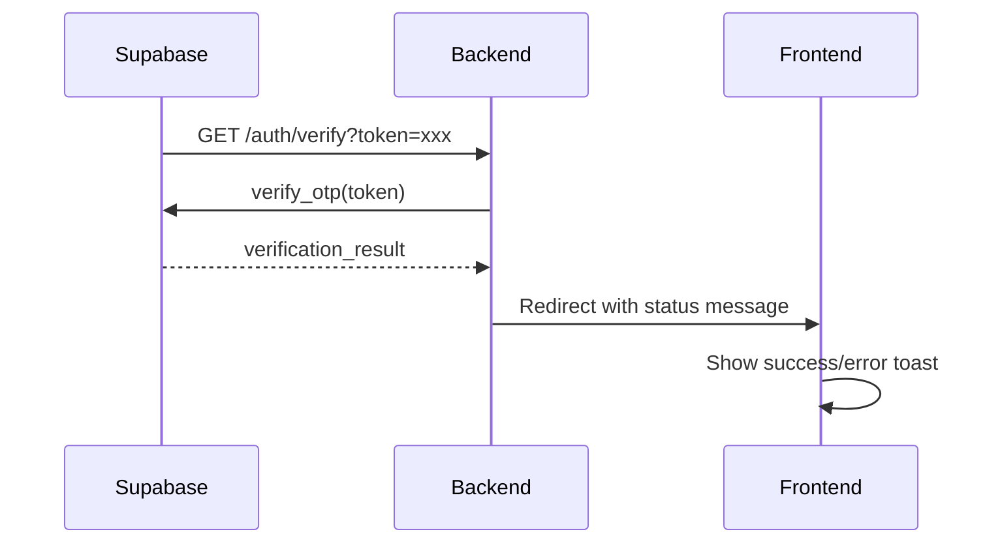

# 📋 Technical Documentation

## 🏗️ System Architecture

### **General Architecture**
```
┌─────────────────┐    HTTP/HTTPS    ┌─────────────────┐
│   Frontend      │ ◄──────────────► │   Backend       │
│   (React)       │                  │   (FastAPI)     │
│   Port: 5173    │                  │   Port: 3000    │
└─────────────────┘                  └─────────────────┘
                                              │
                                              ▼
                                    ┌─────────────────┐
                                    │   Supabase      │
                                    │   (Auth + DB)   │
                                    └─────────────────┘
```

### **Authentication Flow**

1. **User Registration:**
   ```
   Frontend → Backend → Supabase → Email Verification
   ```

2. **User Login:**
   ```
   Frontend → Backend → Supabase → JWT Token → Frontend
   ```

3. **Email Verification:**
   ```
   Supabase → Backend → Frontend → Toast Notification
   ```

## 🔧 System Components

### **Backend (FastAPI)**

#### **Module Structure**
```
backend/
├── main.py                    # Main entry point
├── app/
│   ├── config/               # Application configuration
│   ├── models/               # Pydantic models
│   ├── repositories/         # Data access layer
│   ├── services/             # Business logic
│   └── utils/                # Utilities and helpers
├── requirements.txt          # Python dependencies
└── env.example              # Environment variables template
```

#### **Main Services**

**SupabaseService** (`app/services/`):
- `register_user()` - Registration with email verification
- `authenticate_user()` - Login with validation
- `get_user_by_token()` - Token validation
- `get_all_users()` - User listing

**API Endpoints**:
- `POST /api/register` - User registration
- `POST /api/login` - Authentication
- `GET /api/protected` - Protected route
- `GET /api/users` - User list
- `GET /auth/verify` - Email verification

### **Frontend (React + TypeScript)**

#### **Component Structure**
```
frontend/src/
├── components/
│   ├── LoginForm.tsx         # Login form
│   ├── RegisterForm.tsx      # Registration form
│   ├── Dashboard.tsx         # Main panel
│   ├── Header.tsx            # App header
│   ├── UserProfile.tsx       # User profile
│   ├── QuickAccessCard.tsx   # Quick access cards
│   ├── EmailVerification.tsx # Email verification
│   └── Toast.tsx             # Notifications
├── services/
│   └── api.ts               # API services
├── types/
│   └── api.ts               # TypeScript types
└── App.tsx                  # Root component
```

#### **API Services**

**apiService** (`services/api.ts`):
- Axios configuration with interceptors
- Automatic token handling
- 401 error redirection
- Methods for login, registration and users

#### **Authentication States**

```typescript
interface AuthState {
  isAuthenticated: boolean;
  token: string | null;
  user: User | null;
}
```

## 🔐 Security

### **Environment Variables**
```env
# Supabase Configuration
SUPABASE_URL=https://your-project.supabase.co
SUPABASE_ANON_KEY=your-anon-key

# Server Configuration
HOST=0.0.0.0
PORT=3000

# Frontend Configuration
FRONTEND_URL=http://localhost:5173
```

### **Security Validations**

1. **Mandatory Environment Variables:**
   ```python
   if not SUPABASE_URL:
       raise ValueError("SUPABASE_URL is not configured")
   ```

2. **CORS Configured:**
   ```python
   app.add_middleware(
       CORSMiddleware,
       allow_origins=[FRONTEND_URL],
       allow_credentials=True,
       allow_methods=["*"],
       allow_headers=["*"],
   )
   ```

3. **Supabase Rate Limiting:**
   - Automatic IP limits
   - Security error handling
   - Specific error messages

## 🎨 User Interface

### **Custom Monokai Theme**
```css
:root {
  --monokai-bg: #272822;
  --monokai-fg: #f8f8f2;
  --monokai-green: #a6e22e;
  --monokai-blue: #66d9ef;
  --monokai-purple: #ae81ff;
  --monokai-red: #f92672;
  --monokai-orange: #fd971f;
}
```

### **Reusable Components**

**QuickAccessCard:**
- Integrated SVG icons
- Hover effects
- Responsive design
- Click handlers

**Toast Notifications:**
- React Hot Toast
- Automatic positioning
- Different types (success, error, info)
- Auto-dismiss

## 📊 Data Flows

### **User Registration**


### **User Login**


### **Email Verification**


## 🧪 Testing

### **Test Endpoints**

**Test Supabase Connection:**
```bash
curl http://localhost:3000/api/test-supabase
```

**Test User Registration:**
```bash
curl -X POST http://localhost:3000/api/register-test
```

### **Test Examples**
```python
# tests_example.py
def test_supabase_connection():
    response = client.get("/api/test-supabase")
    assert response.status_code == 200

def test_user_registration():
    response = client.post("/api/register", json={
        "email": "test@example.com",
        "password": "password123"
    })
    assert response.status_code in [200, 201]
```

## 🚀 Deployment

### **System Requirements**
- Python 3.8+
- Node.js 16+
- npm or yarn
- Supabase access

### **Production Environment Variables**
```env
# Production
SUPABASE_URL=https://your-project.supabase.co
SUPABASE_ANON_KEY=your-anon-key
HOST=0.0.0.0
PORT=8000
FRONTEND_URL=https://your-domain.com
```

### **Deployment Scripts**

**Backend:**
```bash
# Install dependencies
pip install -r requirements.txt

# Run with gunicorn (production)
gunicorn main:app -w 4 -k uvicorn.workers.UvicornWorker
```

**Frontend:**
```bash
# Install dependencies
npm install

# Build for production
npm run build

# Serve static files
npm run preview
```

## 📈 Monitoring and Logs

### **Backend Logs**
```python
import logging

logging.basicConfig(
    level=logging.INFO,
    format='%(asctime)s - %(name)s - %(levelname)s - %(message)s'
)
```

### **Important Metrics**
- Successful registration rate
- Email verification rate
- API response time
- Authentication errors

## 🔄 Maintenance

### **Dependency Updates**

**Backend:**
```bash
pip install --upgrade fastapi uvicorn supabase
```

**Frontend:**
```bash
npm update
npm audit fix
```

### **Configuration Backup**
- Environment variables in `.env`
- Supabase configuration
- SSL certificates (production)

## 📚 Additional Resources

- [FastAPI Documentation](https://fastapi.tiangolo.com/)
- [Supabase Documentation](https://supabase.com/docs)
- [React Documentation](https://reactjs.org/docs/)
- [Tailwind CSS Documentation](https://tailwindcss.com/docs) 