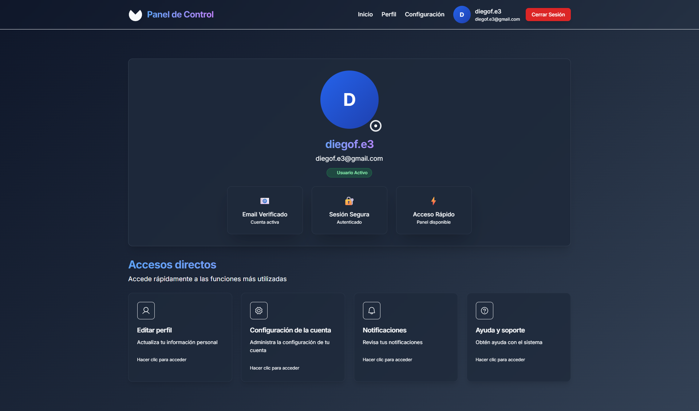
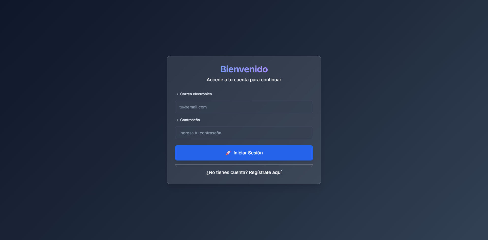

# 🎨 Design System

This document outlines the comprehensive design system for the WebApp Python project, including design principles, component patterns, color schemes, typography, and styling guidelines.

## 📋 Table of Contents

- [Design Philosophy](#design-philosophy)
- [Color Palette](#color-palette)
- [Typography](#typography)
- [Component Library](#component-library)
- [Layout System](#layout-system)
- [Spacing & Grid](#spacing--grid)
- [Effects & Animations](#effects--animations)
- [Responsive Design](#responsive-design)
- [Accessibility](#accessibility)
- [Implementation Guidelines](#implementation-guidelines)

## 🎯 Design Philosophy

### Core Principles

**Modern & Clean**: The design emphasizes simplicity and clarity with a focus on user experience.

**Dark Theme First**: Built around a sophisticated dark color scheme that reduces eye strain and provides excellent contrast.

**Glass Morphism**: Utilizes backdrop blur effects and translucent elements to create depth and modern aesthetics.

**Consistent Interactions**: All interactive elements follow consistent hover, focus, and active states.

**Accessibility First**: Designed with accessibility in mind, ensuring proper contrast ratios and keyboard navigation.

### Design Goals

- **Professional Appearance**: Clean, modern interface suitable for business applications
- **Intuitive Navigation**: Clear visual hierarchy and logical information flow
- **Responsive Design**: Seamless experience across all device sizes
- **Performance Optimized**: Efficient animations and smooth transitions
- **Scalable Architecture**: Modular component system for easy maintenance

## 🎨 Color Palette

### Primary Colors

```css
/* Primary Blue */
--primary-400: #60a5fa;  /* Light blue for accents */
--primary-500: #3b82f6;  /* Main blue for buttons */
--primary-600: #2563eb;  /* Darker blue for hover states */
--primary-700: #1d4ed8;  /* Active states */
```

### Secondary Colors

```css
/* Slate/Gray Scale */
--secondary-100: #f1f5f9;  /* Light text */
--secondary-200: #e2e8f0;  /* Secondary text */
--secondary-300: #cbd5e1;  /* Muted text */
--secondary-400: #94a3b8;  /* Placeholder text */
--secondary-500: #64748b;  /* Border colors */
--secondary-600: #475569;  /* Card backgrounds */
--secondary-700: #334155;  /* Dark backgrounds */
--secondary-800: #1e293b;  /* Main background */
--secondary-900: #0f172a;  /* Darkest background */
```

### Semantic Colors

```css
/* Success */
--success-400: #4ade80;
--success-500: #22c55e;
--success-600: #16a34a;

/* Error */
--error-400: #f87171;
--error-500: #ef4444;
--error-600: #dc2626;

/* Warning */
--warning-400: #fbbf24;
--warning-500: #f59e0b;
--warning-600: #d97706;
```

### Usage Guidelines

- **Primary Blue**: Used for primary actions, links, and important UI elements
- **Secondary Grays**: Used for text, backgrounds, and subtle UI elements
- **Semantic Colors**: Used for status indicators, alerts, and feedback
- **Transparency**: Used with backdrop blur for glass morphism effects

## 📝 Typography

### Font Family

```css
font-family: 'Inter', system-ui, sans-serif;
```

**Inter** is the primary font, chosen for its excellent readability and modern appearance.

### Type Scale

```css
/* Display Text */
.text-display {
  font-weight: 700;
  letter-spacing: -0.025em;
}

/* Headings */
.text-heading {
  font-weight: 600;
  letter-spacing: -0.025em;
}

/* Body Text */
.text-body {
  font-weight: 400;
  line-height: 1.6;
}

/* Monospace */
.text-mono {
  font-family: 'JetBrains Mono', 'Fira Code', 'Consolas', monospace;
}
```

### Font Sizes

```css
/* Responsive Text Sizes */
.responsive-text {
  font-size: 0.875rem;  /* 14px */
}

@media (min-width: 640px) {
  .responsive-text {
    font-size: 1rem;  /* 16px */
  }
}

@media (min-width: 1024px) {
  .responsive-text {
    font-size: 1.125rem;  /* 18px */
  }
}
```

### Text Colors

```css
/* Primary Text */
text-slate-100  /* Main text */
text-slate-200  /* Secondary text */
text-slate-300  /* Muted text */
text-slate-400  /* Placeholder text */

/* Accent Text */
text-blue-400   /* Links and accents */
text-gradient   /* Gradient text for headings */
```

## 🧩 Component Library

### Buttons

#### Primary Button
```css
.btn-primary {
  @apply btn bg-blue-600 text-white hover:bg-blue-700 
         focus:ring-blue-500 shadow-lg hover:shadow-xl active:scale-95;
}
```

#### Secondary Button
```css
.btn-secondary {
  @apply btn bg-slate-700/50 text-slate-100 border border-slate-600/50 
         hover:bg-slate-600/50 focus:ring-slate-500 backdrop-blur-sm;
}
```

#### Button Sizes
```css
.btn-sm { @apply px-4 py-2 text-sm; }
.btn-lg { @apply px-8 py-4 text-lg; }
```

### Form Elements

#### Input Fields
```css
.form-input {
  @apply w-full px-4 py-3 bg-slate-800/50 border border-slate-600/50 
         rounded-lg text-slate-100 placeholder-slate-400 
         focus:outline-none focus:ring-2 focus:ring-blue-500/50 
         focus:border-blue-500 transition-all duration-200 backdrop-blur-sm;
}
```

#### Form Groups
```css
.form-group {
  @apply space-y-2;
}

.form-label {
  @apply block text-sm font-medium text-slate-200 mb-2;
}

.form-error {
  @apply text-sm text-red-400 flex items-center gap-2 mt-2;
}
```

### Cards & Panels

#### Elevated Panel
```css
.panel-elevated {
  @apply bg-white/10 backdrop-blur-md border border-white/20 
         rounded-2xl shadow-xl;
}
```

#### Glass Card
```css
.card-glass {
  @apply bg-slate-800/60 backdrop-blur-lg border border-slate-600/30 
         rounded-xl shadow-2xl p-6;
}
```

### Badges

```css
.badge-primary {
  @apply badge bg-blue-500/20 text-blue-300 border border-blue-500/30;
}

.badge-success {
  @apply badge bg-green-500/20 text-green-300 border border-green-500/30;
}

.badge-error {
  @apply badge bg-red-500/20 text-red-300 border border-red-500/30;
}
```

### Loading States

```css
.loading-spinner {
  @apply w-8 h-8 border-2 border-transparent border-t-blue-500 
         rounded-full animate-spin;
}

.loading-spinner-lg {
  @apply w-12 h-12 border-4 border-transparent border-t-blue-500 
         rounded-full animate-spin;
}
```

## 📐 Layout System

### Container Classes

```css
/* Fluid Container */
.container-fluid {
  @apply w-full max-w-7xl mx-auto px-4 sm:px-6 lg:px-8;
}

/* Narrow Container */
.container-narrow {
  @apply w-full max-w-4xl mx-auto px-4 sm:px-6 lg:px-8;
}

/* Compact Container */
.container-compact {
  @apply w-full max-w-2xl mx-auto px-4 sm:px-6 lg:px-8;
}
```

### Grid System

```css
/* Responsive Grid */
.grid-responsive {
  @apply grid grid-cols-1 sm:grid-cols-2 lg:grid-cols-3 xl:grid-cols-4 gap-6;
}

.grid-responsive-2 {
  @apply grid grid-cols-1 md:grid-cols-2 gap-6;
}

.grid-responsive-3 {
  @apply grid grid-cols-1 sm:grid-cols-2 lg:grid-cols-3 gap-6;
}
```

### Section Spacing

```css
.section {
  @apply py-12 sm:py-16 lg:py-20;
}

.section-sm {
  @apply py-8 sm:py-12;
}

.section-lg {
  @apply py-16 sm:py-20 lg:py-24;
}
```

## 📏 Spacing & Grid

### Spacing Scale

The design system uses Tailwind CSS spacing scale:

```css
/* Base Spacing Units */
space-1: 0.25rem;   /* 4px */
space-2: 0.5rem;    /* 8px */
space-3: 0.75rem;   /* 12px */
space-4: 1rem;      /* 16px */
space-6: 1.5rem;    /* 24px */
space-8: 2rem;      /* 32px */
space-12: 3rem;     /* 48px */
space-16: 4rem;     /* 64px */
space-20: 5rem;     /* 80px */
space-24: 6rem;     /* 96px */
```

### Responsive Spacing

```css
.responsive-padding {
  @apply p-4 sm:p-6 lg:p-8;
}

.responsive-margin {
  @apply m-4 sm:m-6 lg:m-8;
}
```

## ✨ Effects & Animations

### Gradients

```css
.gradient-primary {
  @apply bg-gradient-to-br from-blue-600 to-blue-800;
}

.gradient-secondary {
  @apply bg-gradient-to-br from-slate-700 to-slate-900;
}

.text-gradient {
  @apply bg-gradient-to-r from-blue-400 to-purple-400 
         bg-clip-text text-transparent;
}
```

### Shadows & Glow

```css
.shadow-glow-primary {
  @apply shadow-lg shadow-blue-500/25;
}

.shadow-soft {
  @apply shadow-lg shadow-black/10;
}
```

### Hover Effects

```css
.hover-lift {
  @apply transition-transform duration-200 hover:-translate-y-1 hover:shadow-xl;
}

.hover-glow {
  @apply transition-shadow duration-200 hover:shadow-lg hover:shadow-blue-500/25;
}
```

### Transitions

```css
/* Standard Transition */
transition-all duration-200 ease-out;

/* Fast Transition */
transition-all duration-150 ease-out;

/* Slow Transition */
transition-all duration-300 ease-out;
```

## 📱 Responsive Design

### Breakpoints

```css
/* Mobile First Approach */
sm: 640px   /* Small devices */
md: 768px   /* Medium devices */
lg: 1024px  /* Large devices */
xl: 1280px  /* Extra large devices */
2xl: 1536px /* 2X large devices */
```

### Responsive Utilities

```css
.responsive-text {
  @apply text-sm sm:text-base lg:text-lg;
}

.responsive-padding {
  @apply p-4 sm:p-6 lg:p-8;
}
```

### Mobile Considerations

- Touch targets minimum 44px
- Adequate spacing between interactive elements
- Simplified navigation for mobile
- Optimized form layouts for touch input

## ♿ Accessibility

### Color Contrast

- **Primary Text**: WCAG AA compliant (4.5:1 ratio)
- **Secondary Text**: WCAG AA compliant (3:1 ratio)
- **Interactive Elements**: High contrast for focus states

### Keyboard Navigation

- All interactive elements are keyboard accessible
- Clear focus indicators with blue ring
- Logical tab order

### Screen Reader Support

- Semantic HTML structure
- Proper ARIA labels
- Descriptive alt text for images
- Status announcements for dynamic content

### Focus Management

```css
.focus-ring {
  @apply focus:outline-none focus:ring-2 focus:ring-blue-500/50 
         focus:ring-offset-2 focus:ring-offset-slate-900;
}
```

## 🛠️ Implementation Guidelines

### CSS Architecture

The design system uses a layered approach:

1. **Base Layer**: Tailwind CSS utilities
2. **Component Layer**: Custom component classes
3. **Utility Layer**: Custom utilities and helpers

### File Structure

```
src/
├── index.css          # Main design system file
├── components/        # React components
└── styles/           # Additional stylesheets
```

### Class Naming Convention

- **Components**: `.btn-primary`, `.form-input`, `.card-glass`
- **Utilities**: `.text-gradient`, `.hover-lift`, `.loading-spinner`
- **Responsive**: `.responsive-text`, `.responsive-padding`
- **States**: `.focus-ring`, `.hover-glow`

### Best Practices

1. **Consistency**: Use predefined classes instead of custom CSS
2. **Responsive**: Always consider mobile-first approach
3. **Performance**: Minimize custom CSS, leverage Tailwind utilities
4. **Maintainability**: Use semantic class names and clear structure
5. **Accessibility**: Test with screen readers and keyboard navigation

### Component Development

When creating new components:

1. **Analyze Requirements**: Determine component type and behavior
2. **Choose Base Classes**: Use existing design system classes
3. **Add Custom Styles**: Only when necessary, following naming conventions
4. **Test Responsiveness**: Ensure works across all breakpoints
5. **Verify Accessibility**: Test with assistive technologies

### Color Usage Guidelines

- **Primary Actions**: Use blue-600 for main CTAs
- **Secondary Actions**: Use slate-700/50 for secondary buttons
- **Success States**: Use green-500 for positive feedback
- **Error States**: Use red-500 for errors and warnings
- **Backgrounds**: Use slate-800/900 for main backgrounds
- **Cards**: Use slate-800/60 with backdrop blur

### Typography Guidelines

- **Headings**: Use `.text-display` for main headings
- **Subheadings**: Use `.text-heading` for section titles
- **Body Text**: Use `.text-body` for regular content
- **Code**: Use `.text-mono` for code snippets
- **Responsive**: Use `.responsive-text` for adaptive sizing

---

## 🖼️ Application Interface Examples

### Main Application


### Authentication Pages



---

**Last Updated:** December 2024  
**Version:** 1.0.0  
**Maintainer:** Design System Team 